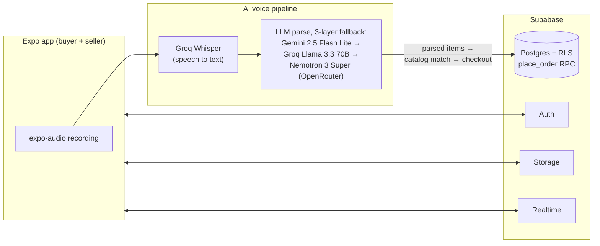

# NgomongAja

**"Just Speak" — voice-first grocery ordering for Indonesian warung and minimarkets.**

Ordering from the warung next door today means walking there or texting a free-form
list on WhatsApp that gets misread. Big platforms rarely list small neighborhood
shops, and typing an itemized order is slow — but *everyone* can talk. NgomongAja
lets a buyer pick a nearby store, tap record, and say their list in casual
Indonesian (Javanese slang and mid-sentence corrections like *"beli gula dua...
eh gajadi, satu aja"* included). The app transcribes the audio, parses it into a
structured order with an LLM, matches it against the store's real catalog, and
lets the buyer review before checkout. On the other side, warung owners get the
order log, stock tracking, and paid/unpaid recaps their paper notebook never gave them.

One Expo app serves both roles, split by `profiles.role` after login.

## Features

### Buyer

- **Voice ordering** — record up to 60 s, see the transcript, review parsed items, fix mismatches inline, then check out
- **Nearby stores** — 5 km radius via bounding-box pre-filter + haversine distance, with favorites and store reviews
- **Manual cart fallback** — browse the catalog and tap to order when voice isn't an option
- **"Pesan Lagi" re-order** — rebuild a cart from any past order in one tap
- **Live order tracking** — status updates arrive over Supabase Realtime; full order history
- **Delivery or self-pickup** — delivery uses saved addresses and per-store fees
- **KTP verification** — optional identity submission for a "Verified" badge

### Seller

- **Multi-store management** — one account, several stores, global pending-order badge, rapid inventory entry
- **Order processing** — accept / reject / ready / complete with a database-enforced state machine; stock decrements and restores automatically
- **Honest recaps** — daily/weekly/monthly revenue split into paid vs unpaid
- **In-app chat** — per-order chat with buyers, including a "request payment" message type
- **Per-store delivery fee** — each store sets its own fee

### Platform

- **Dummy payments** — cash / GoPay / transfer are recorded, never charged; every payment surface says **"DEMO — tidak ada uang berpindah"**
- **Notifications** — local notifications work in Expo Go; remote push plumbing (Expo push API via `pg_net` database triggers) is in place but needs a development build
- **Row Level Security everywhere** — every table has RLS policies, behaviorally audited (see `docs/DB-AUDIT.md`)

## Architecture



Each LLM layer exists because free tiers fail in different ways (daily quota,
demand spikes, per-minute rate limits) — the chain tries the next parser instead
of showing the buyer an error. Checkout goes through a single atomic
`place_order` Postgres function so a failed order never leaves partial rows behind.

## Tech stack

| Layer | Technology |
|---|---|
| Mobile app | Expo SDK 54 (React Native 0.81), expo-router 6, TypeScript |
| Backend | Supabase — Postgres, Auth, Storage, Realtime, RLS |
| Speech-to-text | Groq Whisper (`whisper-large-v3-turbo`) |
| Order parsing | Gemini 2.5 Flash Lite → Groq Llama 3.3 70B → Nemotron 3 Super via OpenRouter |
| Audio & device | expo-audio, expo-location, expo-notifications |
| Remote push | Expo push API called from Postgres triggers via `pg_net` |
| Schema management | Supabase CLI migrations (SQL in git) |

## Repository layout

```
NgomongAja/
├── app/                  # The Expo app (SDK 54 + TypeScript)
│   ├── app/              # expo-router routes: (auth), (buyer), (seller)
│   ├── lib/              # Services layer: supabase, stt, nlp, matching,
│   │                     # orders, stores, chat, notifications, ...
│   └── .env.example      # Every env var the app needs, documented
├── supabase/
│   └── migrations/       # 5 SQL migrations — the schema's source of truth
└── docs/                 # PRD, architecture, database, setup, workflows, audit
```

Earlier prototypes (`mobile/` on Expo + Firebase, and a `web/` experiment) served
as the reference for this rebuild and have since been removed from the tree.

## Quickstart

Prerequisites:

- Node.js LTS (20+)
- A physical Android phone with [Expo Go](https://expo.dev/go) (SDK 54 build) — the mic and GPS matter here, emulators fake both
- A Supabase project, plus API keys for Groq, Gemini, and OpenRouter

Run the app:

```powershell
cd app
copy .env.example .env      # then fill in your real values
npm install
npx expo start              # scan the QR code with Expo Go
```

Apply the database schema to your Supabase project (from the repo root):

```powershell
npx supabase login
npx supabase link --project-ref <your-project-ref>
npx supabase db push        # applies supabase/migrations/ in order
```

That `db push` workflow is how *all* schema changes happen — migrations live in
git, never as dashboard clicks. The full walkthrough (toolchain install, `.env`
hygiene, why each choice was made) is in [docs/SETUP.md](docs/SETUP.md).

After editing `.env`, restart with `npx expo start -c` — env values are read at
bundle time.

## Documentation

| Document | What it covers |
|---|---|
| [docs/PRD.md](docs/PRD.md) | Product requirements — features, personas, order state machine, scope decisions. The source of truth. |
| [docs/ARCHITECTURE.md](docs/ARCHITECTURE.md) | System overview, screen map, services layer, key decisions and why |
| [docs/DATABASE.md](docs/DATABASE.md) | ERD (13 tables), column-by-column schema, RLS policy matrix |
| [docs/SETUP.md](docs/SETUP.md) | Toolchain, Supabase CLI + migrations workflow, secrets handling |
| [docs/WORKFLOWS.md](docs/WORKFLOWS.md) | Step-by-step flows: registration, the voice order pipeline, order lifecycle, payments, chat |
| [docs/DB-AUDIT.md](docs/DB-AUDIT.md) | Behavioral RLS audit of the live database — findings and fixes |

## Project status — read before judging

This is a **learning project**, built step by step by a beginner, and it is
honest about its shortcuts:

- **Payments are fake.** Methods and statuses are recorded in the database, but
  no gateway is called and no money moves — the UI says so on every screen.
- **AI API keys ship in the client** (`EXPO_PUBLIC_` env vars) for prototyping.
  Anyone with the APK can extract them. The planned fix is a Supabase Edge
  Function proxy that holds the keys server-side (see `docs/SETUP.md` §5.4).
- **Remote push needs a development build.** In Expo Go you get local
  notifications only; the `pg_net` trigger plumbing is ready and waiting.
- No admin UI — KTP verifications are reviewed manually in the Supabase dashboard.

## Credits

Built as a guided learning project by Maxi, with Claude Code as the pair
programmer and patient explainer. The mistakes are original; the lessons are documented.
