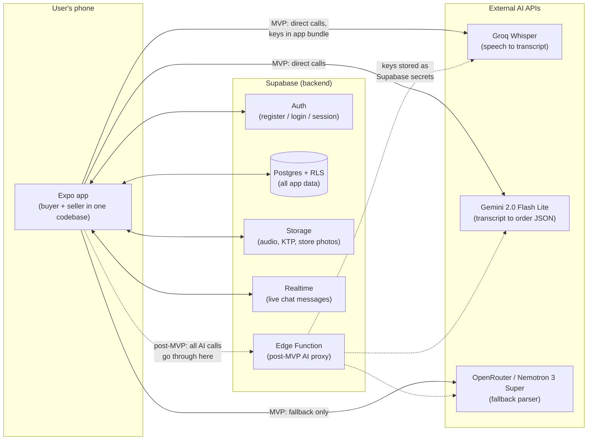

# NgomongAja — Architecture Overview

> Audience: a beginner software engineer. This document explains **what the
> moving parts are, where they live, and why they were chosen** — before any
> code is written. It does not contain code; the implementation phase does.
>
> Companion docs: [PRD.md](./PRD.md) (features, source of truth),
> [SETUP.md](./SETUP.md) (toolchain, repo layout, secrets),
> [DATABASE.md](./DATABASE.md) (schema), [WORKFLOWS.md](./WORKFLOWS.md) (flows).

---

## 1. System overview

Three parties talk to each other:

1. **The Expo app** (`app/` folder — one React Native codebase for both buyer
   and seller, split by `profiles.role`).
2. **Supabase** — the backend-as-a-service: Auth (login), Postgres (data),
   Storage (files), Realtime (live updates for chat).
3. **External AI APIs** — the voice pipeline: Groq Whisper turns audio into a
   transcript (STT = Speech-to-Text), then an LLM (Large Language Model) turns
   the transcript into structured order JSON.



**Read the dashed arrows carefully.** For the MVP, the app calls Groq, Gemini,
and OpenRouter **directly**, with API keys shipped in the app bundle as
`EXPO_PUBLIC_` variables. This is a deliberate, temporary shortcut for a
private learning prototype (see SETUP.md §5.4 and §3 below). Post-MVP, all AI
calls move behind a **Supabase Edge Function** — a small serverless function
that holds the keys as server-side secrets — so the app bundle contains zero
external API keys (PRD NFR-3).

---

## 2. Client architecture (the Expo app)

### 2.1 Screen map (expo-router)

expo-router turns files into screens: a file under the router directory *is* a
route. The app splits into three route groups — auth, buyer, seller — and the
login response (`profiles.role`) decides which group the user lands in (PRD
A-3). This is a **conceptual** map derived from the PRD stories; exact file
names are decided during implementation.

```
(auth)                          — logged-out users only
├── login                       A-3  login, role-based routing
├── register                    A-1/A-2  choose role: buyer or seller
├── register-buyer              A-1  personal-info form
└── register-seller             A-2  step 1 personal info → step 2 first store

(buyer)                         — tab navigator, role = 'buyer'
├── [tab] index "Toko Terdekat" B-1  nearby stores within 5 km
├── [tab] history "Riwayat"     B-4  order list, newest first
├── [tab] profile "Profil"      B-5  name/phone, badge, addresses
│   ├── verification            B-6  KTP submission (pending OQ-2)
│   └── addresses               B-5  add/edit saved addresses
├── store/[id]                  B-1  store page: catalog, reviews, photos
├── store/[id]/voice-order      B-2  record → review/edit → fulfillment
│                                    (+ address if delivery) → payment wall
└── order/[id]                  B-3/B-4/PA-2  detail, live status, cancel,
                                     chat entry point

(seller)                        — tab navigator, role = 'seller'
├── [tab] index "Dashboard"     S-1  counts, paid/unpaid revenue, store
│                                    switcher with global pending badge
├── [tab] orders "Pesanan"      S-2  order log for the selected store
│   └── order/[id]              S-2  detail, Terima/Tolak/Siap/Selesai,
│                                    cancel-with-reason, mark COD paid,
│                                    "Minta pembayaran" → chat
├── [tab] recap "Rekap"         S-3  daily/weekly/monthly aggregates
├── [tab] products "Produk"     S-4  inventory list, add/edit product
└── [tab] profile "Profil"      S-5  personal info, store list, add/edit store

chat/[orderId]                  C-1  shared by both roles (RLS decides access)
```

**Why one app instead of two?** One codebase, one login system, shared
components (order detail, chat), and the PRD fixes it as a tech constraint
(§4.1). The role split lives in the router: after login the app reads
`profiles.role` and redirects to `(buyer)` or `(seller)`; a user never sees
the other role's screens.

### 2.2 Services layer

Screens should never talk to Supabase or AI APIs directly. Instead, a small
services layer (plain TypeScript modules, no framework) does the work, and
screens call it. **Why?** When the AI calls move behind an Edge Function
post-MVP, only the service files change — no screen is touched.

| Module (conceptual) | Responsibility |
|---|---|
| `lib/supabase.ts` | The single shared Supabase client (already specified in SETUP.md §4.2). Every other module imports it. |
| `services/voicePipeline` | The heart of the app. One function per pipeline step: record audio (max 60 s), upload to Storage, transcribe (Groq), parse (Gemini with 10 s timeout → one OpenRouter fallback → JSON-extraction step that pulls valid JSON out of the raw LLM text), match parsed items against the store's products. Each step reports its own failure so **retry can resume from the failed step with the same audio** (PRD B-2). |
| `services/orders` | Checkout creation (orders + order_items + payments + link voice_recordings in one go), status transitions, the auto-expiry check-on-read (PRD AS-12), stock decrement/restore triggers via database calls. |
| `services/catalog` | Product CRUD for sellers, the buyer-facing catalog fetch, the "Cari produk" type-ahead search. |
| `services/chat` | Get-or-create the chat for an order, send messages, subscribe to Supabase Realtime for live delivery. |
| `services/geo` | Haversine distance (PRD B-1), device GPS access, Google Maps link parsing. |

### 2.3 Where state lives

A beginner trap is reaching for a heavy state library (Redux) on day one.
This app does not need one. State lives in four places, from most to least
authoritative:

| State | Lives in | Why |
|---|---|---|
| All business data (orders, products, payments, chats…) | **Postgres, always.** Screens fetch on focus and re-fetch on pull-to-refresh; chat and order status also arrive via Realtime. | The server is the single source of truth. Two phones (buyer + seller) look at the same order — only the database can keep them consistent. |
| Login session | Supabase Auth client + AsyncStorage (device key-value storage). | Handled automatically by the client from SETUP.md §4.2; the session survives app restarts (A-3). |
| Small global client state: current profile + role, seller's **selected store id** | One lightweight React Context, with the selected store persisted to AsyncStorage. | The role gates routing; the selected store must persist across restarts (S-5) and be visible in every seller header (S-1). |
| The in-progress voice order draft (recorded audio file, transcript, parsed lines, edits, fulfillment choice) | React state local to the voice-order flow, plus the audio file on disk and the `voice_recordings` row. | Nothing is a real order until checkout writes `orders` (B-2: "no partial order is ever created on failure"). Keeping the draft local means abandoning it costs nothing. The audio file persists so retry never asks the user to speak again (NFR-7). |

---

## 3. Key decisions and why

### Why Supabase instead of Firebase?

The old prototype (`mobile/`, read-only reference) used Firebase. The rebuild
switches to Supabase for three concrete reasons:

1. **Orders are relational.** One order joins `order_items` → `products`,
   `payments`, `addresses`, `stores`, and `profiles`. In Postgres that is one
   query with joins. In Firestore (a document database) you either duplicate
   data into each order document and keep the copies in sync by hand, or fire
   N separate reads per screen. The seller recap (S-3) is explicitly a SQL
   aggregation — sums and top-5-by-quantity over three tables — which
   Firestore cannot express server-side at all.
2. **SQL is the durable skill.** This is a learning project (PRD §1). Schema
   migrations in git (SETUP.md §4.4) and hand-written SQL transfer to nearly
   every future job; Firestore query rules do not.
3. **Row Level Security (RLS).** Authorization rules like "sellers may update
   only orders belonging to their own stores" (S-2) live *in the database* and
   are enforced on every request, even if the app has a bug. NFR-4 and NFR-9
   require server-side enforcement; RLS plus database constraints deliver it
   without writing a custom backend. See DATABASE.md §4 for the policy matrix.

### Why does the AI parsing run client-side for the MVP?

The "proper" design (app → Edge Function → Groq/Gemini) is the post-MVP
target. The MVP calls the AI APIs straight from the app because:

- **Fewer moving parts while learning.** Every pipeline change is a Fast
  Refresh on the phone, not a server deploy. The LLM prompt will be tuned many
  times against the NFR-10 test set — a tight feedback loop matters most
  exactly there.
- **The risk is bounded and acknowledged.** The exposed keys can only burn
  API quota, never touch user data (the Supabase *secret* key is never in the
  app — see SETUP.md §5). This trade is acceptable only for a private
  prototype, which is why NFR-3 makes the Edge Function migration mandatory
  before any real users, and why the services layer (§2.2) isolates the swap
  to a few files.

### Why is chat the only Realtime feature (at first)?

Supabase Realtime pushes database changes to subscribed clients. Chat (C-1)
needs it — "the other party sees it without manually refreshing" is an
acceptance criterion. Everything else works with fetch-on-focus. PA-2 (live
order status on the buyer's order detail) and PA-9 (in-app notifications)
reuse the same Realtime mechanism once chat proves it works — learn the
pattern once, in the smallest possible scope.

---

## 4. Where things live in the repo

Follows SETUP.md §1 exactly:

| Path | Contents |
|---|---|
| `app/` | The Expo app described in §2 (SDK 54, TypeScript, expo-router). |
| `supabase/migrations/` | Every schema change as SQL, in git. DATABASE.md is the plan; migrations are the implementation. |
| `docs/` | This file and its companions. |
| `mobile/`, `web/` | Old prototypes. **Read-only reference. Never edit.** |

> Note: PRD AS-10 still says `mobile/` is "the Expo app workspace". SETUP.md
> (written later, for the rebuild) supersedes that: the new app lives in
> `app/`, and `mobile/` is frozen reference material.

---

*End of ARCHITECTURE.md — next read DATABASE.md for the schema, then
WORKFLOWS.md for the flows.*
