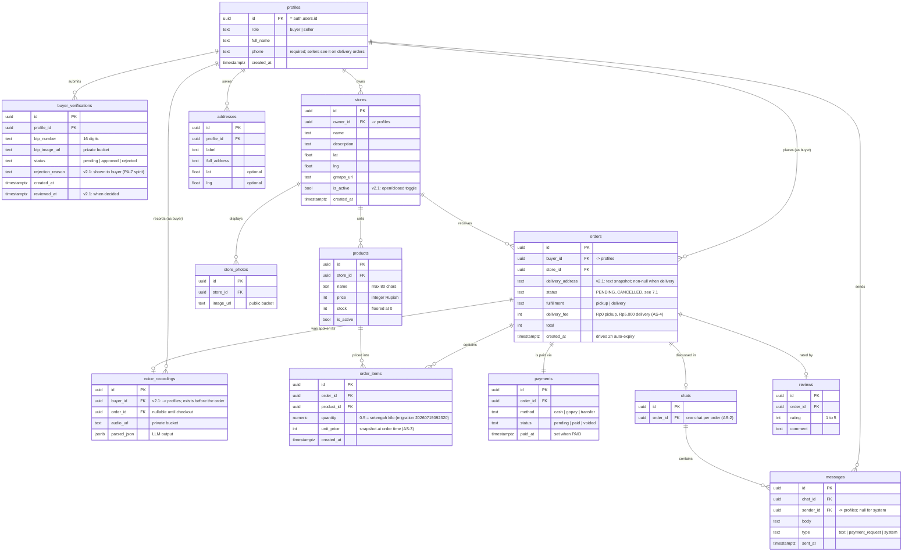

# NgomongAja — Database Design (ERD v2.1 — as built)

> Audience: a beginner software engineer. This document is the **plan** for the
> schema; the actual `CREATE TABLE` / RLS SQL comes later as migrations in
> `supabase/migrations/` (workflow in SETUP.md §4.4). Features and state
> machines referenced here are defined in [PRD.md](./PRD.md) — the PRD wins if
> anything conflicts.

---

## 1. ERD v2 diagram

ERD = Entity-Relationship Diagram: the tables (entities) and the foreign keys
(relationships) between them. All 13 ERD v1 tables stand. **v2.1 reflects the
schema as actually built in the Supabase project on 2026-07-15** — the owner
created the tables directly, with a few deliberate improvements over the v2
paper design (see §2).

`profiles.id` is special: it is **the same UUID as the Supabase Auth user id**
(`auth.users.id`). Auth stores the login credentials; `profiles` stores the
app-facing data (role, name, phone) for that same person.

---

## 2. Changes from ERD v1 (as built — v2.1)

| # | Change | Justification (one line) |
|---|---|---|
| 1 | **`orders.delivery_address` (text, nullable)** instead of the planned `address_id` FK — must be **non-null when `fulfillment = 'delivery'`**, `NULL` for pickup. The buyer still picks from their saved `addresses`; the app copies the chosen address text into the order. | A **snapshot** beats a FK for history: if the buyer later edits or deletes the saved address, past orders still show where they were actually delivered. (Same principle as `order_items.unit_price`.) |
| 2 | **`voice_recordings.buyer_id`** (FK → profiles), with `order_id` nullable. | The recording exists *before* the order does (record → parse → confirm → order); `buyer_id` ties it to its owner from the moment of upload. |
| 3 | **`buyer_verifications.rejection_reason` + `reviewed_at`** | A rejected KTP with no reason reads as an accusation (end-user review); `reviewed_at` records when the manual review happened. |
| 4 | **`stores.is_active`** | Lets a seller close a store without deleting it — also serves the "open/closed toggle" Could-have (PRD §9). |
| 5 | `order_items.quantity` (not `qty`) + `created_at` timestamps on most tables. | Clearer name; timestamps cost nothing and every "sort by newest" screen needs them. |

**Considered and deliberately NOT added** (the PRD forbids inventing columns —
§10: "Do not invent further tables/columns for MVP"):

| Candidate column | Why it is not needed |
|---|---|
| `orders.cancel_reason` / `orders.reject_reason` | Seller cancel/reject reasons are posted to the order's chat as a `messages` row with `type = 'system'` (PRD §7.1, AS-11, PA-7) — the data already has a home. |
| `orders.expires_at` | Auto-expiry is computed from `orders.created_at` + one named 2-hour constant in code, evaluated check-on-read (PRD AS-12) — a stored copy would just be a second thing to keep in sync. |
| `stores.delivery_fee` | Delivery fee is an app-wide constant for MVP (AS-4); the per-store column is explicitly post-MVP (PA-8). |

---

## 3. Tables: purpose, one by one

Each table exists to serve specific PRD stories — if you cannot name the
story, the table should not exist.

**`profiles`** — One row per user, sharing its id with the Supabase Auth user.
Holds the `role` that routes login to the buyer or seller experience (A-3),
plus name and phone. The phone is mandatory because sellers need it as the
delivery contact on every order (A-1, S-2).

**`buyer_verifications`** — A buyer's KTP submission: number, private image
URL, and review status (B-6). A rejected buyer resubmits by inserting a new
`pending` row, so one buyer can have several rows over time. Reviewed manually
in the Supabase dashboard — there is no admin app (AS-1).

**`stores`** — A seller-owned shop with name, description, and location
(`lat`/`lng` for the 5 km nearby search in B-1, `gmaps_url` for the map link).
One seller owns many stores (S-5); every seller screen operates on one
selected store at a time.

**`store_photos`** — Proof photos uploaded at seller registration (A-2), which
double as the store page gallery (AS-9). The database stores only URLs; the
files live in the public `store-photos` bucket.

**`products`** — The catalog the voice pipeline matches against (B-2) and the
buyer browses (B-1). `price` is integer Rupiah, `stock` gates ordering
("Habis" at 0), and `is_active = false` hides a product from buyers without
breaking historical orders (S-4).

**`addresses`** — A buyer's saved delivery addresses with a label ("Rumah")
and free-text address; GPS is optional (B-5). Used as the delivery destination
picker at checkout (B-2), and as the search-center fallback when location
permission is denied (B-1).

**`orders`** — The central table: who bought, from which store, current
service status (§7.1), fulfillment type, delivery fee, total, and — new in v2
— the delivery address. `created_at` doubles as the auto-expiry clock. Read by
buyer history (B-4), the seller dashboard/log (S-1/S-2), and recaps (S-3).

**`order_items`** — The lines of an order. `unit_price` is **snapshotted** at
checkout so a seller editing prices later never rewrites history (AS-3). Also
the source for stock restore quantities and the top-5-items recap (S-3).

**`voice_recordings`** — The audio URL and the LLM's `parsed_json` for a voice
order (B-2). Created when the pipeline starts, linked to the order at
checkout. Enables retry-with-same-audio and prompt debugging; whether sellers
may ever replay audio is open (OQ-7 — assume no).

**`payments`** — Exactly one per order, created `pending` at checkout. Records
the dummy method and status (§7.2); no real money ever moves (PA-12). Feeds
the paid/unpaid revenue split that sellers care about most (S-1, S-3).

**`chats`** — One row per order, created lazily on the first message (AS-2).
Exists so `messages` has a stable parent scoped to exactly one order (C-1).

**`messages`** — Chat messages: normal `text`, seller `payment_request`
(S-2), and app-generated `system` notes such as seller cancel/reject reasons
(§7.1, PA-7). Delivered live via Supabase Realtime.

**`reviews`** — One rating + comment per completed order, displayed on the
store page with the average in the header (C-2). The submission flow is PA-1
(proposed for MVP); without it the table stays empty but the display code
still works.

---

## 4. Enums and status values (canonical — copy exactly)

**All lowercase** — canon decided 2026-07-15 to match the live database's CHECK
constraints (PRD v1.3 §7). Where older prose uses UPPERCASE (PENDING etc.), it
refers to these same lowercase stored values.

| Field | Values | Source |
|---|---|---|
| `profiles.role` | `buyer`, `seller` | PRD §6 · CHECK exists in live DB |
| `orders.status` | `pending`, `accepted`, `ready`, `completed`, `rejected`, `cancelled` | PRD §7.1 · live DB CHECK was missing `accepted`/`rejected` — fixed by `supabase/security_fixes.sql` |
| `orders.fulfillment` | `pickup`, `delivery` | matches live DB CHECK |
| `payments.status` | `pending` (belum dibayar), `paid`, `voided` (displayed "Dibatalkan", PA-12) | PRD §7.2 · live DB CHECK was missing `voided` — fixed by security_fixes.sql |
| `payments.method` | `cash` (COD), `gopay`, `transfer` | PRD §7.2 · matches live DB CHECK |
| `buyer_verifications.status` | `pending`, `approved`, `rejected` | PRD B-6 · CHECK exists in live DB |
| `messages.type` | `text`, `payment_request`, `system` | PRD C-1 · live DB CHECK was missing `system` — fixed by security_fixes.sql |

Enforce these in Postgres (enum types or CHECK constraints), not only in app
code — NFR-9 demands that illegal values and transitions are rejected
server-side.

---

## 5. Row Level Security (RLS) — plain-language policy plan

**What is RLS?** Normally, anyone holding a database connection can read every
row. Row Level Security is a Postgres feature where you attach rules to each
table like "a user may only SELECT rows where `buyer_id` = their own id". The
database itself enforces the rule on **every** query — so even a buggy or
malicious app using the public (publishable) key cannot see or change data
the logged-in user doesn't own. This is why shipping the publishable key in
the app is safe (SETUP.md §5.1) and how S-2's "RLS blocks it server-side"
criterion is met.

Every table gets RLS **enabled**; a table with RLS enabled and no policy
denies everything by default. The matrix below is the plan in plain language
— the SQL comes in the migrations phase.

| Table | Who can SELECT | Who can INSERT | Who can UPDATE / DELETE |
|---|---|---|---|
| `profiles` | Own row; plus the counterpart on a shared order (seller reads buyer name + phone, buyer reads seller name); reviewer first names are shown with reviews (C-2). | Self, once, at registration (id = own auth id). | Own row only (name, phone). Role never changes (no role switching, PRD §9). |
| `buyer_verifications` | Own rows. | Self, only if no `pending` row exists (B-6). | Nobody from the app. Reviewer decides via the Supabase dashboard, which bypasses RLS (AS-1). |
| `stores` | Everyone, even logged-out browsing is fine (public storefronts). | Sellers, with `owner_id` = self. | Owner only. |
| `store_photos` | Everyone. | Store owner only. | Store owner only. |
| `products` | Everyone **where `is_active = true`**; the owner also sees their own inactive products (S-4). | Store owner only. | Store owner edits price/stock/is_active. Stock changes tied to order transitions go through a server-side function, not free-form buyer updates. |
| `addresses` | Owner; plus the seller of a **delivery** order that references the address (S-2 needs the full address). | Owner. | Owner. |
| `orders` | The buyer (own orders); the seller (orders of own stores). | The buyer, only as `PENDING` with `buyer_id` = self. | Only legal state-machine transitions (§7.1), enforced by a trigger or RPC: buyer may cancel own `PENDING` order; seller may advance/cancel orders of own stores; expiry is system logic. Never raw free-form updates. No DELETE — terminal orders stay as history. |
| `order_items` | Anyone who can see the parent order. | Created with the order at checkout, by the buyer. | Nobody — lines are immutable snapshots (AS-3). |
| `voice_recordings` | The buyer who recorded it (seller playback is OQ-7 — default no). | The buyer, during the voice flow. | The buyer links `order_id` at checkout; otherwise immutable. |
| `payments` | Same visibility as the parent order. | Created `pending` at checkout by the buyer. | Buyer sets `paid` for gopay/transfer (simulated pay); seller sets `paid` for COD (`cash`) on own store's order; `voided` is system logic on cancel/reject. Only §7.2 transitions allowed. |
| `chats` | The order's buyer and the store's owner — nobody else (C-1). | Either of those two, lazily on first message. | Nobody. |
| `messages` | Same two people as the chat. | Same two people; `system` messages are written by app/server logic during cancel/reject. | Nobody — chat history is immutable. |
| `reviews` | Everyone (store page, C-2). | The order's buyer, once per `COMPLETED` order (PA-1; once-per-order vs once-per-store is OQ-6). | Nobody for MVP. |

Two habits worth learning now:

- **UI hiding is not security.** Hide the "Batalkan" button when a buyer's
  order is `ACCEPTED` — but the database must *also* refuse the transition.
- **Complex writes go through functions.** Multi-table moves (checkout,
  accept-with-stock-decrement, cancel-with-restore-and-void) should be a
  Postgres function (RPC) so they succeed or fail as one unit, with the rules
  checked inside.

---

## 6. Storage buckets

Supabase Storage holds files; the database stores only URLs. Three buckets:

| Bucket | Visibility | Access rules (plain language) |
|---|---|---|
| `ktp-images` | **Private** | A buyer uploads only into their own folder (e.g. `{profile_id}/…`). Only that buyer can read their image, via a short-lived **signed URL** (a temporary link the server generates — the file is never publicly reachable). The project owner reviews via the dashboard. This is a national ID photo: the most sensitive file in the system (NFR-4, OQ-2). |
| `store-photos` | **Public** | Anyone can view (they render on public store pages, B-1). Only the store's owner can upload or delete photos for their store. |
| `voice-recordings` | **Private** | A buyer uploads only into their own folder; only that buyer can read it (signed URLs). Voice is personal data, and whether sellers may replay it is unresolved (OQ-7) — default closed. |

**Why default-private?** Making a bucket public is one click and irreversible
in spirit (URLs leak). Start private, open up only what the product needs
public — exactly one bucket here.

---

*End of DATABASE.md — the flows that read and write these tables are in
[WORKFLOWS.md](./WORKFLOWS.md).*
