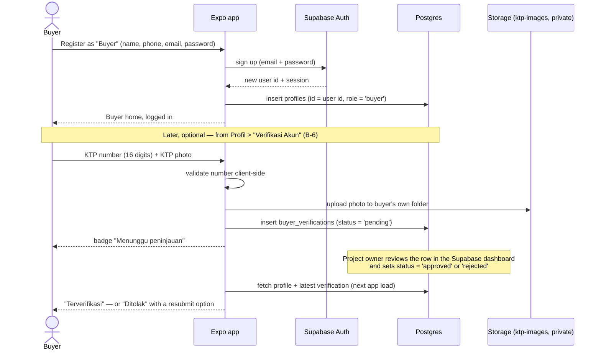
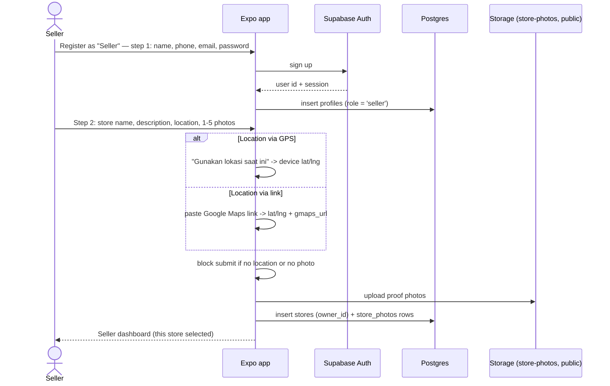
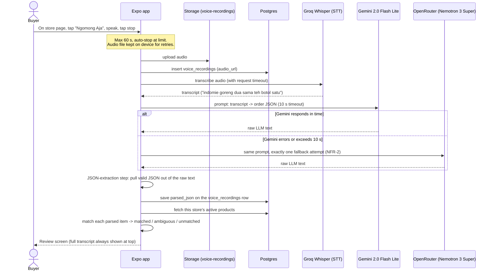
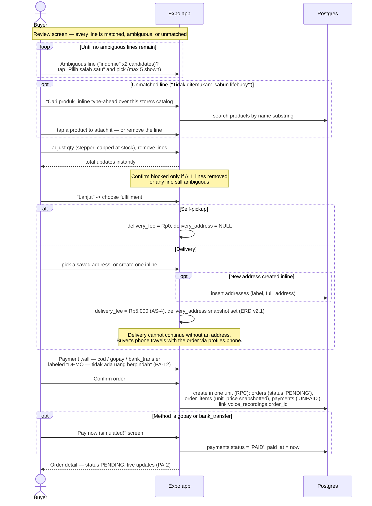
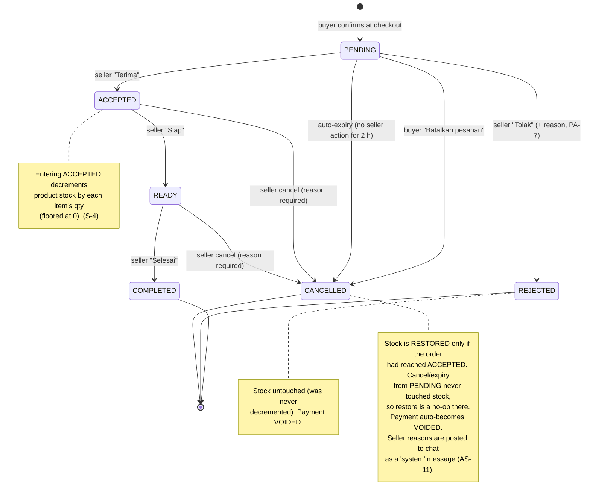
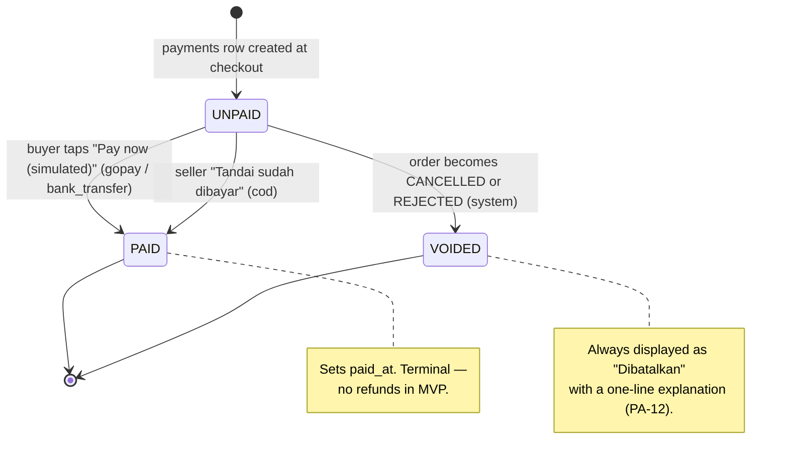
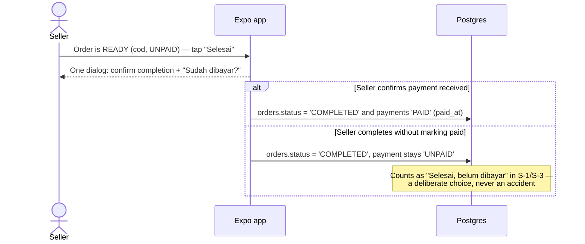
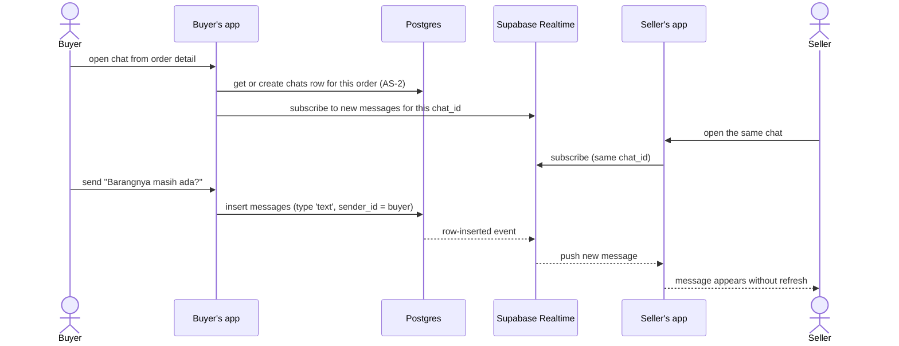

# NgomongAja — Key Workflows

> Audience: a beginner software engineer. Each section shows one core flow
> from [PRD.md](./PRD.md) v1.1 as a diagram plus short prose. Read the PRD
> story first, then the diagram here — the PRD defines *what must happen*,
> this document shows *in what order the pieces talk to each other*.
>
> Tables and enums referenced here are defined in [DATABASE.md](./DATABASE.md).

---

## 1. Buyer registration & KTP verification (A-1, B-6)

Registration is deliberately light: no KTP at sign-up. KTP verification is a
separate, optional step from the profile — and review happens manually in the
Supabase dashboard, because there is no admin app in MVP (AS-1).

Rules to remember: only one `pending` submission at a time; a rejection is
resolved by inserting a **new** `pending` row, not editing the old one; the
badge gates nothing for MVP (AS-7, OQ-1/OQ-2).

---

## 2. Seller registration & store setup (A-2)

Seller registration is two steps: the same personal-info form, then the first
store. A seller account **cannot exist without at least one store** — every
seller screen operates on a selected store.

The store is live for buyers immediately — proof photos are display photos,
not a review gate (AS-9, OQ-5). Adding a second store later (S-5) reuses
exactly the step-2 form.

---

## 3. The voice order flow (B-2) — the centerpiece

This is the feature the whole app exists for. It has two halves: the
**pipeline** (audio → structured lines) and the **review & checkout** (human
confirms → order rows). Nothing is written to `orders` until the very last
step — a failed or abandoned attempt leaves no partial order (B-2).

### 3.1 Pipeline: record → transcribe → parse → match

**Failure & retry — never make the user speak twice.** If any step fails
*after* the fallback (upload, STT, or LLM), the app shows a plain Indonesian
error with two buttons:

- **"Coba lagi"** (retry) — reuses the already-recorded audio and resumes
  **from the failed step**: if upload succeeded but STT failed, retry calls
  Whisper again without re-uploading. This is why each pipeline step in the
  service layer reports its own failure (ARCHITECTURE.md §2.2).
- **"Rekam ulang"** (re-record) — only if the *user* wants to start over.

The parsing prompt must handle mid-sentence corrections (last statement wins),
Javanese/slang mixing, and unit-less quantities (default qty 1) — the full
criteria and the ≥ 10-recording test set live in PRD B-2 and NFR-10.

### 3.2 Review, fulfillment, address, dummy payment

**Why review before checkout?** STT and LLMs make mistakes. Showing the full
transcript plus an editable line list makes the human the final authority —
the app must never silently guess (the ambiguous-picker rule) and never
dead-end (the unmatched re-match picker).

---

## 4. Order lifecycle state machine (PRD §7.1)

This must be implemented **exactly** — no skipped or reversed transitions,
enforced server-side (NFR-9), not just hidden in the UI.

Key rules in prose:

- The buyer can cancel **only** in `PENDING`; from `ACCEPTED` onward only the
  seller can cancel, and must type a reason (min 5 chars) which the app posts
  to the order chat as a `type = 'system'` message.
- Auto-expiry: the 2-hour timeout is one named constant; MVP may implement it
  as **check-on-read** — whenever an order is fetched, a `PENDING` order older
  than the timeout is treated (and persisted) as `CANCELLED` (AS-12). The
  buyer sees "Kedaluwarsa — toko tidak merespons".
- Only the seller who owns the order's store may perform seller transitions
  (RLS + transition function, DATABASE.md §5).

---

## 5. Payment status flow (PRD §7.2)

Payments are dummy: a method and a status in the database, no gateway.

Two flows deserve a closer look:

**COD mark-paid at "Selesai" (S-2).** COD is paid in cash at handover, so the
natural moment to record it is when the seller completes the order:

**Payment request via chat (S-2 + C-1).** While a payment is `UNPAID` (and
not `VOIDED`), the seller taps **"Minta pembayaran"**: the app opens the
order's in-app chat (creating the `chats` row if it does not exist yet) and
sends a prefilled `type = 'payment_request'` message stating the amount due
and method, rendered distinctly in the chat. **Never WhatsApp, SMS, or any
external channel** — this is an explicit PRD prohibition.

---

## 6. In-app chat with Supabase Realtime (C-1)

Supabase Realtime pushes database changes to subscribed clients over a
websocket, so neither side ever has to refresh manually.

Notes:

- One chat per order; created lazily on the first message from either side,
  a payment request, or a system message (AS-2).
- Three message types render differently: `text` (bubble),
  `payment_request` (distinct card with amount + method), `system`
  (centered gray note — e.g. the seller's cancel reason from §4).
- RLS restricts each chat to exactly two people: the order's buyer and the
  store's owner (DATABASE.md §5). Realtime respects the same policies.
- MVP is text-only: no images, typing indicators, or read receipts.

---

*End of WORKFLOWS.md — with PRD.md, SETUP.md, ARCHITECTURE.md, and
DATABASE.md, the planning set is complete; next phase is migrations + auth
(SETUP.md §8, phases 1-2).*
